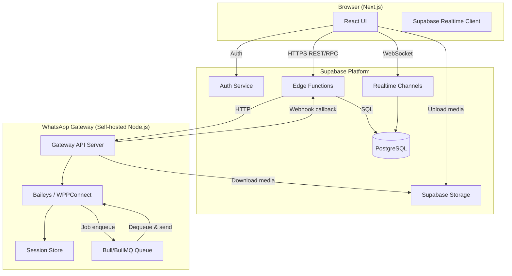
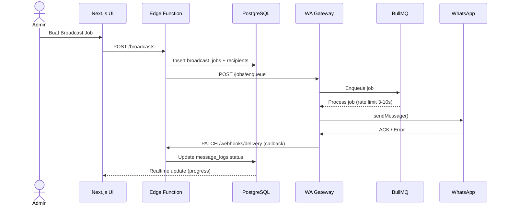
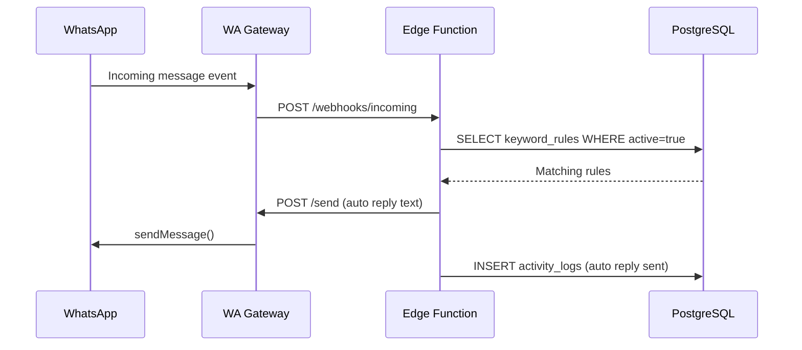
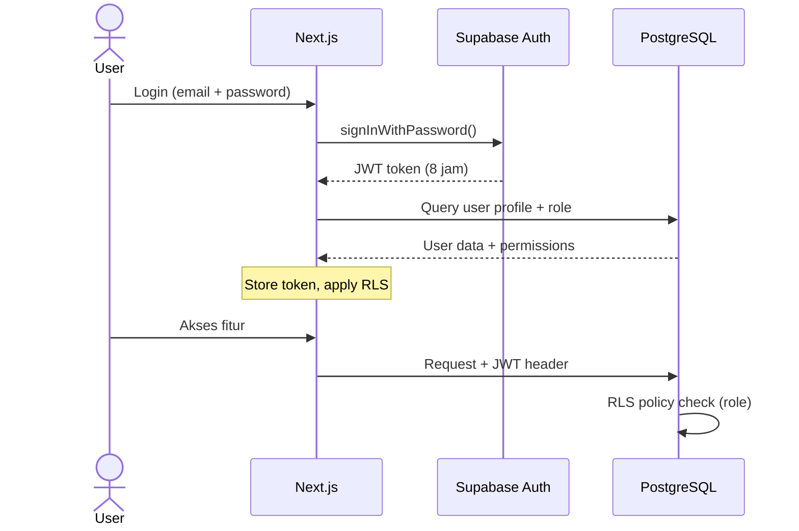
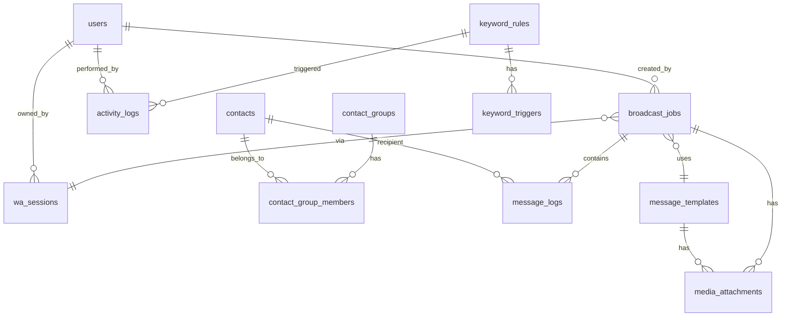

# Dokumen Desain: WhatsApp Broadcast CRM

## Gambaran Umum

WhatsApp Broadcast CRM adalah platform komunikasi berbasis web yang mengintegrasikan WhatsApp Web API untuk pengiriman pesan massal terkelola. Sistem terdiri dari tiga lapisan utama: frontend Next.js, backend Supabase (PostgreSQL + Auth + Realtime + Edge Functions), dan WhatsApp Gateway Service berbasis Node.js (Baileys/WPPConnect) yang di-host secara mandiri.

Tujuan utama desain adalah memastikan:
- Pengiriman pesan broadcast yang andal dengan rate limiting dan resume otomatis
- Isolasi multi-tenant dengan permission matrix berbasis role
- Skalabilitas horizontal pada komponen gateway WhatsApp
- Audit trail lengkap selama 90 hari

---

## Arsitektur



### Komponen Utama

| Komponen | Teknologi | Tanggung Jawab |
|---|---|---|
| Frontend | Next.js 14 (App Router) | UI, routing, realtime updates |
| Auth | Supabase Auth | JWT, session management, RLS |
| Database | PostgreSQL (Supabase) | Penyimpanan data utama |
| Edge Functions | Deno (Supabase) | Business logic, webhook handler |
| Realtime | Supabase Realtime | Push updates broadcast progress |
| Media Storage | Supabase Storage | Penyimpanan file media |
| WhatsApp Gateway | Node.js + Baileys | Koneksi WA, pengiriman pesan |
| Job Queue | BullMQ + Redis | Antrian broadcast asinkron |

### Alur Broadcast (Broadcast Flow)



### Alur Auto Reply



### Alur Autentikasi



---

## Komponen dan Antarmuka

### Frontend Components (Next.js App Router)

```
app/
├── (auth)/
│   └── login/           - Halaman login
├── dashboard/           - Dashboard utama
├── contacts/            - Manajemen kontak
│   ├── import/          - Import CSV/XLSX
│   └── groups/          - Manajemen grup
├── broadcasts/          - Broadcast jobs
│   ├── new/             - Buat broadcast baru
│   └── [id]/            - Detail & laporan
├── templates/           - Template pesan
├── auto-reply/          - Keyword rules
├── sessions/            - WA session management
├── users/               - Manajemen user (Owner only)
└── logs/                - Log aktivitas
```

### Edge Functions API

| Endpoint | Method | Fungsi |
|---|---|---|
| `/functions/v1/broadcasts` | POST | Buat broadcast job baru |
| `/functions/v1/broadcasts/{id}/cancel` | PATCH | Batalkan broadcast |
| `/functions/v1/broadcasts/{id}/resume` | PATCH | Lanjutkan broadcast terputus |
| `/functions/v1/contacts/import` | POST | Import CSV/XLSX |
| `/functions/v1/webhooks/delivery` | PATCH | Callback status pengiriman dari gateway |
| `/functions/v1/webhooks/incoming` | POST | Pesan masuk (trigger auto reply) |
| `/functions/v1/sessions/qr` | GET | Generate/ambil QR code |
| `/functions/v1/dashboard/stats` | GET | Statistik dashboard |

### WhatsApp Gateway API (Internal)

| Endpoint | Method | Fungsi |
|---|---|---|
| `/jobs/enqueue` | POST | Tambah broadcast ke queue |
| `/jobs/{id}/cancel` | DELETE | Batalkan job dari queue |
| `/send` | POST | Kirim satu pesan (text/media) |
| `/sessions` | GET | Daftar sesi aktif |
| `/sessions/{id}/qr` | GET | QR code stream (SSE) |
| `/sessions/{id}/disconnect` | POST | Putuskan sesi |

---

## Model Data

### Diagram Relasi Entitas



### Tabel Database Lengkap

#### `users`
```sql
CREATE TABLE users (
    id          UUID PRIMARY KEY DEFAULT gen_random_uuid(),
    email       TEXT UNIQUE NOT NULL,
    full_name   TEXT NOT NULL,
    role        TEXT NOT NULL CHECK (role IN ('owner', 'admin', 'staff', 'operator')),
    is_active   BOOLEAN NOT NULL DEFAULT true,
    created_at  TIMESTAMPTZ NOT NULL DEFAULT now(),
    updated_at  TIMESTAMPTZ NOT NULL DEFAULT now(),
    -- FK ke auth.users Supabase
    auth_user_id UUID UNIQUE REFERENCES auth.users(id) ON DELETE CASCADE
);
```

#### `contacts`
```sql
CREATE TABLE contacts (
    id              UUID PRIMARY KEY DEFAULT gen_random_uuid(),
    full_name       TEXT NOT NULL,
    wa_number       TEXT UNIQUE NOT NULL,  -- format: 628xxxxxxxxxx
    category        TEXT,
    status          TEXT NOT NULL DEFAULT 'active' CHECK (status IN ('active', 'inactive')),
    notes           TEXT,
    joined_at       DATE NOT NULL DEFAULT CURRENT_DATE,
    created_by      UUID REFERENCES users(id),
    created_at      TIMESTAMPTZ NOT NULL DEFAULT now(),
    updated_at      TIMESTAMPTZ NOT NULL DEFAULT now()
);

CREATE INDEX idx_contacts_wa_number ON contacts(wa_number);
CREATE INDEX idx_contacts_status ON contacts(status);
```

#### `contact_groups`
```sql
CREATE TABLE contact_groups (
    id          UUID PRIMARY KEY DEFAULT gen_random_uuid(),
    name        TEXT NOT NULL,
    description TEXT,
    created_by  UUID REFERENCES users(id),
    created_at  TIMESTAMPTZ NOT NULL DEFAULT now(),
    updated_at  TIMESTAMPTZ NOT NULL DEFAULT now()
);
```

#### `contact_group_members`
```sql
CREATE TABLE contact_group_members (
    contact_id  UUID NOT NULL REFERENCES contacts(id) ON DELETE CASCADE,
    group_id    UUID NOT NULL REFERENCES contact_groups(id) ON DELETE CASCADE,
    added_at    TIMESTAMPTZ NOT NULL DEFAULT now(),
    PRIMARY KEY (contact_id, group_id)
);
```

#### `media_attachments`
```sql
CREATE TABLE media_attachments (
    id              UUID PRIMARY KEY DEFAULT gen_random_uuid(),
    storage_path    TEXT NOT NULL,       -- path di Supabase Storage
    original_name   TEXT NOT NULL,
    mime_type       TEXT NOT NULL,
    file_size_bytes BIGINT NOT NULL,
    caption         TEXT,
    uploaded_by     UUID REFERENCES users(id),
    created_at      TIMESTAMPTZ NOT NULL DEFAULT now()
);
```

#### `message_templates`
```sql
CREATE TABLE message_templates (
    id              UUID PRIMARY KEY DEFAULT gen_random_uuid(),
    title           TEXT NOT NULL,
    body            TEXT NOT NULL,       -- mendukung {{nama}}, {{nomor}}, dll
    attachment_id   UUID REFERENCES media_attachments(id),
    created_by      UUID REFERENCES users(id),
    created_at      TIMESTAMPTZ NOT NULL DEFAULT now(),
    updated_at      TIMESTAMPTZ NOT NULL DEFAULT now()
);
```

#### `wa_sessions`
```sql
CREATE TABLE wa_sessions (
    id              UUID PRIMARY KEY DEFAULT gen_random_uuid(),
    session_key     TEXT UNIQUE NOT NULL,  -- identifier di gateway
    phone_number    TEXT,
    display_name    TEXT,
    status          TEXT NOT NULL DEFAULT 'disconnected'
                        CHECK (status IN ('connected', 'disconnected', 'expired', 'pairing')),
    last_active_at  TIMESTAMPTZ,
    expires_at      TIMESTAMPTZ,           -- 30 hari inaktif
    owner_id        UUID REFERENCES users(id),
    created_at      TIMESTAMPTZ NOT NULL DEFAULT now(),
    updated_at      TIMESTAMPTZ NOT NULL DEFAULT now()
);
```

#### `broadcast_jobs`
```sql
CREATE TABLE broadcast_jobs (
    id                  UUID PRIMARY KEY DEFAULT gen_random_uuid(),
    title               TEXT NOT NULL,
    message_body        TEXT NOT NULL,     -- sudah ter-resolve atau template raw
    template_id         UUID REFERENCES message_templates(id),
    attachment_id       UUID REFERENCES media_attachments(id),
    wa_session_id       UUID NOT NULL REFERENCES wa_sessions(id),
    status              TEXT NOT NULL DEFAULT 'draft'
                            CHECK (status IN ('draft','scheduled','running','paused','completed','cancelled','failed')),
    recipient_type      TEXT NOT NULL CHECK (recipient_type IN ('all','group','manual')),
    scheduled_at        TIMESTAMPTZ,       -- NULL = immediate
    started_at          TIMESTAMPTZ,
    completed_at        TIMESTAMPTZ,
    last_sent_index     INTEGER DEFAULT 0, -- posisi resume
    total_recipients    INTEGER DEFAULT 0,
    sent_count          INTEGER DEFAULT 0,
    failed_count        INTEGER DEFAULT 0,
    rate_limit_min_ms   INTEGER DEFAULT 3000,
    rate_limit_max_ms   INTEGER DEFAULT 10000,
    created_by          UUID REFERENCES users(id),
    created_at          TIMESTAMPTZ NOT NULL DEFAULT now(),
    updated_at          TIMESTAMPTZ NOT NULL DEFAULT now()
);

CREATE INDEX idx_broadcast_jobs_status ON broadcast_jobs(status);
CREATE INDEX idx_broadcast_jobs_scheduled ON broadcast_jobs(scheduled_at) WHERE status = 'scheduled';
```

#### `broadcast_recipients`
```sql
CREATE TABLE broadcast_recipients (
    id              UUID PRIMARY KEY DEFAULT gen_random_uuid(),
    broadcast_id    UUID NOT NULL REFERENCES broadcast_jobs(id) ON DELETE CASCADE,
    contact_id      UUID NOT NULL REFERENCES contacts(id),
    send_order      INTEGER NOT NULL,      -- urutan pengiriman
    PRIMARY KEY (broadcast_id, contact_id)
);
```

#### `message_logs`
```sql
CREATE TABLE message_logs (
    id              UUID PRIMARY KEY DEFAULT gen_random_uuid(),
    broadcast_id    UUID NOT NULL REFERENCES broadcast_jobs(id),
    contact_id      UUID NOT NULL REFERENCES contacts(id),
    wa_number       TEXT NOT NULL,
    status          TEXT NOT NULL DEFAULT 'pending'
                        CHECK (status IN ('pending','sent','delivered','read','failed')),
    error_code      TEXT,
    error_message   TEXT,
    sent_at         TIMESTAMPTZ,
    delivered_at    TIMESTAMPTZ,
    read_at         TIMESTAMPTZ,
    created_at      TIMESTAMPTZ NOT NULL DEFAULT now()
);

CREATE INDEX idx_message_logs_broadcast ON message_logs(broadcast_id);
CREATE INDEX idx_message_logs_status ON message_logs(status);
CREATE INDEX idx_message_logs_created ON message_logs(created_at);
```

#### `keyword_rules`
```sql
CREATE TABLE keyword_rules (
    id              UUID PRIMARY KEY DEFAULT gen_random_uuid(),
    name            TEXT NOT NULL,
    response_text   TEXT NOT NULL,
    is_active       BOOLEAN NOT NULL DEFAULT true,
    is_greeting     BOOLEAN NOT NULL DEFAULT false,  -- pesan sambutan
    wa_session_id   UUID REFERENCES wa_sessions(id),
    created_by      UUID REFERENCES users(id),
    created_at      TIMESTAMPTZ NOT NULL DEFAULT now(),
    updated_at      TIMESTAMPTZ NOT NULL DEFAULT now()
);
```

#### `keyword_triggers`
```sql
CREATE TABLE keyword_triggers (
    id          UUID PRIMARY KEY DEFAULT gen_random_uuid(),
    rule_id     UUID NOT NULL REFERENCES keyword_rules(id) ON DELETE CASCADE,
    keyword     TEXT NOT NULL,  -- disimpan lowercase
    created_at  TIMESTAMPTZ NOT NULL DEFAULT now()
);

CREATE INDEX idx_keyword_triggers_keyword ON keyword_triggers(keyword);
```

#### `greeted_contacts`
```sql
-- Melacak kontak yang sudah menerima greeting (agar tidak dikirim dua kali)
CREATE TABLE greeted_contacts (
    contact_wa_number   TEXT NOT NULL,
    session_id          UUID NOT NULL REFERENCES wa_sessions(id),
    greeted_at          TIMESTAMPTZ NOT NULL DEFAULT now(),
    PRIMARY KEY (contact_wa_number, session_id)
);
```

#### `activity_logs`
```sql
CREATE TABLE activity_logs (
    id          UUID PRIMARY KEY DEFAULT gen_random_uuid(),
    user_id     UUID REFERENCES users(id),
    action      TEXT NOT NULL,   -- e.g. 'broadcast.create', 'contact.delete', 'user.login'
    entity_type TEXT,            -- e.g. 'broadcast', 'contact', 'user'
    entity_id   TEXT,
    detail      JSONB,
    ip_address  INET,
    created_at  TIMESTAMPTZ NOT NULL DEFAULT now()
);

CREATE INDEX idx_activity_logs_user ON activity_logs(user_id);
CREATE INDEX idx_activity_logs_created ON activity_logs(created_at);
-- Retensi 90 hari via pg_cron atau scheduled Edge Function
```

#### `failed_login_attempts`
```sql
CREATE TABLE failed_login_attempts (
    email       TEXT NOT NULL,
    attempt_at  TIMESTAMPTZ NOT NULL DEFAULT now(),
    ip_address  INET
);

CREATE INDEX idx_failed_logins_email_time ON failed_login_attempts(email, attempt_at);
```

### Row-Level Security (RLS) Policy Matrix

| Tabel | Owner | Admin | Staff | Operator |
|---|---|---|---|---|
| users | CRUD | Read self | Read self | Read self |
| contacts | CRUD | CRUD | Read | Read |
| contact_groups | CRUD | CRUD | Read | Read |
| broadcast_jobs | CRUD | CRUD | CRUD | — |
| message_logs | CRUD | Read | Read | — |
| message_templates | CRUD | CRUD | Read | — |
| keyword_rules | CRUD | CRUD | Read | — |
| activity_logs | Read | Read | — | — |
| wa_sessions | CRUD | Read | Read | — |

---

## Penanganan Error

### Kategorisasi Error

| Kode | Kategori | Penanganan |
|---|---|---|
| `WA_DISCONNECTED` | Gateway | Pause job, notifikasi UI, simpan posisi resume |
| `WA_BANNED` | Gateway | Stop semua job, alert Owner |
| `MSG_INVALID_NUMBER` | Validasi | Tandai log sebagai failed, lanjut ke penerima berikutnya |
| `MSG_RATE_LIMITED` | Rate limit | Exponential backoff, retry setelah delay |
| `MEDIA_TOO_LARGE` | Validasi | Tolak upload, tampilkan error ke user |
| `AUTH_LOCKED` | Auth | Kunci akun 15 menit, catat di activity_logs |
| `PERM_DENIED` | Auth/Otorisasi | Return 403, catat akses ditolak |
| `IMPORT_PARTIAL` | Import | Lanjutkan baris valid, laporkan baris gagal |

### Strategi Retry Broadcast

```
Attempt 1: Langsung
Attempt 2: delay 5 detik
Attempt 3: delay 15 detik
Setelah 3 kali gagal: tandai status = 'failed', lanjut ke penerima berikutnya
```

### Resume Job saat Gateway Terputus

Kolom `last_sent_index` pada `broadcast_jobs` diperbarui setelah setiap pesan berhasil dikirim. Saat gateway reconnect, job dengan status `paused` dilanjutkan mulai dari `last_sent_index + 1`.

---

## Pertimbangan Keamanan

1. **RLS Supabase** — semua tabel memiliki Row Level Security aktif; query frontend melalui Supabase client terikat JWT user.
2. **JWT 8 jam** — token di-refresh secara silent; jika sesi berakhir, redirect ke login.
3. **Bcrypt password** — Supabase Auth menggunakan bcrypt secara default.
4. **Rate limiting login** — 5 gagal = kunci 15 menit, dicatat di `failed_login_attempts`.
5. **Gateway API Key** — Komunikasi Edge Function → Gateway menggunakan API key internal (env variable), tidak pernah terekspos ke browser.
6. **Media validation** — file type dan ukuran divalidasi di Edge Function sebelum disimpan ke Storage.
7. **Nomor WA sanitization** — format nomor dibersihkan dan divalidasi sebelum disimpan (strip karakter non-numerik, pastikan prefix 62).
8. **Webhook secret** — Callback dari gateway ke Edge Function diverifikasi menggunakan HMAC signature.

---

## Pertimbangan Skalabilitas

1. **Horizontal scaling gateway** — Gateway Node.js stateless (session di-store ke Redis/file), dapat dijalankan multiple instance dengan load balancer.
2. **BullMQ queue** — Pengiriman diproses asinkron; Redis sebagai broker antrian memungkinkan job persist saat restart.
3. **Index database** — Index pada kolom yang sering di-query (`wa_number`, `broadcast_id`, `status`, `created_at`).
4. **Pagination** — Semua daftar dipaginasi (50 item/halaman) untuk mencegah query besar.
5. **Realtime selective** — Subscribe Realtime hanya ke channel broadcast aktif, bukan seluruh tabel.
6. **Log retention** — `activity_logs` dihapus otomatis setelah 90 hari via scheduled job.


---

## Correctness Properties

*A property is a characteristic or behavior that should hold true across all valid executions of a system — essentially, a formal statement about what the system should do. Properties serve as the bridge between human-readable specifications and machine-verifiable correctness guarantees.*

---

### Property 1: Akurasi Statistik Dashboard

*Untuk semua* kumpulan data kontak, pesan, dan broadcast job yang tersimpan di database, angka yang dikembalikan oleh endpoint dashboard stats harus sama persis dengan hasil COUNT/aggregasi langsung dari tabel sumber.

**Validates: Requirements 1.1, 1.2, 1.3, 1.5**

---

### Property 2: Realtime Update Saat Status Berubah

*Untuk semua* perubahan status `wa_sessions` yang tersimpan ke database, subscriber Realtime yang aktif harus menerima event perubahan tersebut tanpa membutuhkan reload halaman.

**Validates: Requirements 1.7**

---

### Property 3: Grafik Tren 7 Hari Selalu 7 Titik Data

*Untuk semua* kumpulan message_logs, fungsi agregasi tren harian harus menghasilkan tepat 7 titik data yang masing-masing merepresentasikan satu hari dalam rentang 7 hari terakhir.

**Validates: Requirements 1.8**

---

### Property 4: Round-Trip Data Kontak

*Untuk semua* contact dengan atribut valid (nama, nomor WA, kategori, status, tanggal masuk), menyimpan lalu mengambil kembali contact tersebut harus menghasilkan data yang identik dengan data yang disimpan.

**Validates: Requirements 2.1, 2.4**

---

### Property 5: Validasi Format Nomor WA

*Untuk semua* string nomor, hanya string yang sesuai format internasional (dimulai dengan `62`, hanya digit, panjang 10–15 digit) yang boleh diterima; semua format lain harus ditolak.

**Validates: Requirements 2.2**

---

### Property 6: Uniqueness Nomor WA

*Untuk semua* pasangan kontak dalam database, tidak boleh ada dua kontak dengan `wa_number` yang sama; setiap upaya insert atau update yang menghasilkan duplikasi harus ditolak dengan pesan error.

**Validates: Requirements 2.3**

---

### Property 7: Pencarian Kontak Mengembalikan Hasil Relevan

*Untuk semua* query pencarian `q`, setiap contact yang dikembalikan harus mengandung `q` dalam kolom `full_name` atau `wa_number` (case-insensitive).

**Validates: Requirements 2.6**

---

### Property 8: Filter Kontak Menghasilkan Subset yang Konsisten

*Untuk semua* kombinasi filter (grup, kategori, status), setiap contact dalam hasil filter harus memenuhi seluruh kriteria filter yang diterapkan; tidak boleh ada contact yang lolos filter jika tidak memenuhi kriteria.

**Validates: Requirements 2.7**

---

### Property 9: Paginasi Tidak Melebihi Batas

*Untuk semua* halaman daftar contact, jumlah item yang dikembalikan tidak boleh melebihi 50; keseluruhan halaman-halaman harus mencakup semua contact yang memenuhi filter secara tepat tanpa duplikasi atau penghilangan.

**Validates: Requirements 2.8**

---

### Property 10: Hapus Grup Tidak Menghapus Kontak

*Untuk semua* contact yang terdaftar dalam sebuah Contact_Group, setelah grup tersebut dihapus, contact harus masih ada di tabel `contacts` dengan data yang tidak berubah.

**Validates: Requirements 3.4**

---

### Property 11: Jumlah Anggota Grup Akurat

*Untuk semua* Contact_Group, angka `member_count` yang dikembalikan harus sama dengan `COUNT(*)` dari tabel `contact_group_members` dengan `group_id` yang sesuai.

**Validates: Requirements 3.5, 6.2**

---

### Property 12: Import Partial — Konsistensi Laporan

*Untuk semua* file import dengan N baris data, hasil laporan harus memenuhi: `berhasil + dilewati_duplikat + gagal = N`; tidak boleh ada baris yang hilang dari laporan.

**Validates: Requirements 4.3, 4.4**

---

### Property 13: Kontak Hasil Import Masuk ke Grup Tujuan

*Untuk semua* proses import yang ditargetkan ke Contact_Group tertentu, setiap contact yang berhasil diimport harus terdaftar sebagai anggota grup tersebut.

**Validates: Requirements 4.5**

---

### Property 14: Variabel Template Harus Ter-resolve Sepenuhnya

*Untuk semua* Message_Template yang mengandung variabel `{{nama}}`, `{{nomor}}`, atau variabel kustom, setelah di-resolve dengan data contact yang valid, string hasil tidak boleh mengandung satu pun placeholder yang belum diisi (pola `{{...}}`).

**Validates: Requirements 5.2, 6.7**

---

### Property 15: Validasi Template Kosong

*Untuk semua* string yang kosong atau hanya terdiri dari whitespace, sistem harus menolak penyimpanan sebagai isi `message_templates.body`.

**Validates: Requirements 5.3**

---

### Property 16: Recipient Selection Konsisten dengan Kriteria

*Untuk semua* Broadcast_Job dengan `recipient_type = 'all'`, daftar `broadcast_recipients` harus mencakup semua contact dengan `status = 'active'`; untuk `recipient_type = 'group'`, hanya anggota grup terpilih; untuk `recipient_type = 'manual'`, tepat contact yang dipilih.

**Validates: Requirements 6.1, 6.3**

---

### Property 17: Scheduled Broadcast Tidak Dikirim Sebelum Waktunya

*Untuk semua* Broadcast_Job dengan `scheduled_at` di masa depan, waktu mulai eksekusi aktual (`started_at`) tidak boleh lebih awal dari `scheduled_at`.

**Validates: Requirements 6.4**

---

### Property 18: Rate Limiter dalam Batas yang Ditentukan

*Untuk semua* pasangan pengiriman pesan berturut-turut dalam satu Broadcast_Job, jeda waktu antara pengiriman harus berada dalam rentang `[rate_limit_min_ms, rate_limit_max_ms]` yang dikonfigurasi (default 3000–10000 ms).

**Validates: Requirements 6.5**

---

### Property 19: Semua Penerima Tercatat di message_logs

*Untuk semua* Broadcast_Job yang telah selesai (`status = 'completed'`), jumlah baris di `message_logs` dengan `broadcast_id` yang sesuai harus sama dengan `total_recipients` pada broadcast tersebut.

**Validates: Requirements 6.6, 7.1**

---

### Property 20: Resume Broadcast Tidak Mengirim Ulang Pesan Terkirim

*Untuk semua* Broadcast_Job yang dilanjutkan setelah gangguan, nilai `last_sent_index` saat resume harus lebih besar atau sama dengan nilai sebelum gangguan; tidak boleh ada penurunan `last_sent_index`.

**Validates: Requirements 6.8**

---

### Property 21: Statistik Broadcast Akurat

*Untuk semua* Broadcast_Job, persamaan berikut harus selalu terpenuhi: `sent_count + failed_count + pending_count = total_recipients`, di mana `pending_count` adalah jumlah message_logs dengan status 'pending'.

**Validates: Requirements 7.3**

---

### Property 22: Filter Tanggal Riwayat Broadcast

*Untuk semua* query riwayat dengan rentang tanggal `[start, end]`, setiap Broadcast_Job dalam hasil harus memiliki `created_at` di dalam rentang tersebut; tidak boleh ada job di luar rentang yang muncul.

**Validates: Requirements 7.4**

---

### Property 23: Ekspor CSV Round-Trip

*Untuk semua* data Broadcast_Job, mengekspor ke CSV kemudian memparsing kembali harus menghasilkan baris data yang identik dengan data sumber (jumlah baris sama, field yang diekspor tidak berubah).

**Validates: Requirements 7.5**

---

### Property 24: Sesi Expired Setelah 30 Hari Inaktif

*Untuk semua* WhatsApp_Session, nilai `expires_at` harus selalu sama dengan `last_active_at + 30 hari`; sesi dengan `now() > expires_at` harus berstatus 'expired'.

**Validates: Requirements 8.5**

---

### Property 25: Permission Matrix Ditegakkan untuk Semua Role

*Untuk semua* kombinasi (user_role, resource, action), akses harus sesuai Permission_Matrix: permintaan yang tidak diizinkan harus mendapatkan respons 403 dan tidak ada efek samping pada data.

**Validates: Requirements 9.1, 9.6, 9.7, 9.8**

---

### Property 26: Kunci Akun Setelah 5 Kali Gagal Login

*Untuk semua* akun, setelah tepat 5 kali percobaan login yang gagal dalam satu sesi, percobaan ke-6 harus ditolak dengan status 'locked' tanpa memeriksa kebenaran password.

**Validates: Requirements 9.2**

---

### Property 27: Token JWT Memiliki Masa Berlaku 8 Jam

*Untuk semua* token JWT yang diterbitkan oleh sistem, nilai `exp` (expiration) harus sama dengan `iat` (issued at) ditambah tepat 8 jam (28800 detik).

**Validates: Requirements 9.3**

---

### Property 28: Password Tidak Tersimpan sebagai Plaintext

*Untuk semua* password yang disimpan, string yang tersimpan di kolom password hash tidak boleh sama dengan password plaintext aslinya; dan hash harus dapat diverifikasi ulang dengan bcrypt.compare().

**Validates: Requirements 9.5**

---

### Property 29: Setiap Aksi Penting Menghasilkan Entry di activity_logs

*Untuk semua* aksi yang termasuk dalam daftar aksi penting (login, pembuatan broadcast, perubahan kontak, perubahan role, error pengiriman, auto reply), setelah aksi tersebut dilakukan harus selalu ada entry baru di `activity_logs` dengan `action`, `user_id`, dan `created_at` yang tepat.

**Validates: Requirements 10.1, 10.4, 12.7**

---

### Property 30: Retensi Log Maksimal 90 Hari

*Untuk semua* entry di `activity_logs`, entry yang memiliki `created_at` lebih dari 90 hari yang lalu harus dihapus oleh proses scheduled cleanup; tidak boleh ada log berumur > 90 hari yang tersisa setelah cleanup berjalan.

**Validates: Requirements 10.3**

---

### Property 31: Validasi Media (Ukuran dan Format)

*Untuk semua* file yang diupload sebagai media attachment, file dengan ukuran > 16 MB atau dengan MIME type di luar whitelist (JPEG, PNG, MP4, PDF, DOCX, XLSX) harus ditolak; hanya file yang memenuhi kedua kriteria yang diizinkan tersimpan.

**Validates: Requirements 11.2, 11.3**

---

### Property 32: Broadcast dengan Media Mengirim Media ke Semua Penerima

*Untuk semua* Broadcast_Job yang memiliki `attachment_id`, semua message_logs yang dihasilkan harus mencatat jenis pengiriman sebagai media (bukan text-only); tidak boleh ada penerima yang hanya mendapatkan teks sementara penerima lain mendapat media.

**Validates: Requirements 11.7**

---

### Property 33: Keyword Matching Tidak Case-Sensitive

*Untuk semua* Keyword_Rule aktif dan semua pesan masuk, pencocokan keyword harus berhasil terlepas dari kapitalisasi pesan; pesan "HALO", "halo", dan "Halo" harus memicu rule yang sama jika keywordnya "halo".

**Validates: Requirements 12.1**

---

### Property 34: Tidak Ada Auto Reply untuk Pesan Tanpa Kecocokan

*Untuk semua* pesan masuk yang tidak mengandung kata kunci dari Keyword_Rule manapun yang aktif, sistem tidak boleh mengirimkan respons apapun.

**Validates: Requirements 12.6**

---

### Property 35: Rule Dinonaktifkan Tidak Memicu Auto Reply

*Untuk semua* Keyword_Rule dengan `is_active = false`, pesan yang mengandung keyword dari rule tersebut tidak boleh memicu auto reply, bahkan jika keyword tersebut cocok secara tekstual.

**Validates: Requirements 12.5**

---

### Property 36: Greeting Dikirim Maksimal Satu Kali per Kontak per Sesi

*Untuk semua* kontak yang sudah ada di tabel `greeted_contacts` dengan `session_id` tertentu, sistem tidak boleh mengirimkan greeting kembali untuk kombinasi (contact_wa_number, session_id) yang sama.

**Validates: Requirements 12.8**

---

### Property 37: Minimal Satu Owner Aktif Selalu Terpenuhi

*Untuk semua* operasi pada tabel `users` (update role, deactivate, delete), sistem harus memastikan `COUNT(users WHERE role='owner' AND is_active=true) >= 1` setelah operasi; jika operasi akan melanggar invariant ini, operasi harus ditolak.

**Validates: Requirements 13.5, 13.6**

---

### Property 38: Perubahan Role Mengakhiri Sesi Aktif User

*Untuk semua* perubahan role user, sesi aktif (token JWT) milik user tersebut harus diinvalidasi segera setelah perubahan disimpan; request selanjutnya dengan token lama harus mendapatkan respons 401.

**Validates: Requirements 13.4, 13.8**

---

## Strategi Testing

### Pendekatan Dual Testing

Sistem menggunakan dua pendekatan testing yang saling melengkapi:

1. **Unit tests** — menguji contoh spesifik, edge case, dan kondisi error
2. **Property-based tests** — menguji properti universal di seluruh input yang di-generate secara acak

Unit tests fokus pada:
- Contoh konkret yang mendemonstrasikan perilaku benar
- Titik integrasi antar komponen
- Edge case seperti file kosong, nomor batas, dan string ekstrem

Property-based tests fokus pada:
- Properti universal dari Correctness Properties di atas
- Input coverage yang komprehensif melalui randomisasi

### Library Property-Based Testing

| Layer | Bahasa | Library PBT |
|---|---|---|
| Backend (Edge Functions) | TypeScript/Deno | `fast-check` |
| Frontend (React) | TypeScript | `fast-check` |
| Gateway Service | Node.js | `fast-check` |

### Konfigurasi Property Test

- Minimum **100 iterasi** per property test
- Setiap property test harus diberi tag komentar referensi:
  ```
  // Feature: whatsapp-broadcast-crm, Property {N}: {property_text}
  ```
- Setiap Correctness Property diimplementasikan oleh **satu** property-based test

### Contoh Implementasi Property Test

```typescript
// Feature: whatsapp-broadcast-crm, Property 6: Uniqueness Nomor WA
import fc from 'fast-check';
import { test, expect } from 'vitest';

test('wa_number uniqueness invariant', () => {
  fc.assert(
    fc.asyncProperty(
      fc.string({ minLength: 10, maxLength: 15 }).filter(s => /^62\d+$/.test(s)),
      async (waNumber) => {
        await insertContact({ wa_number: waNumber, full_name: 'Test' });
        const result = await insertContact({ wa_number: waNumber, full_name: 'Duplicate' });
        expect(result.error).toBeTruthy();
        expect(result.error.code).toBe('23505'); // PostgreSQL unique violation
      }
    ),
    { numRuns: 100 }
  );
});
```

### Cakupan Testing per Layer

#### Unit Tests (Vitest)
- Fungsi validasi nomor WA (format, length)
- Fungsi resolve variabel template
- Fungsi kalkulasi statistik dashboard
- Parser CSV/XLSX import
- Logika keyword matching (case-insensitive)
- Permission matrix checker

#### Property-Based Tests (fast-check)
- Semua 38 properti di atas
- Generator khusus: `arb.waNumber()`, `arb.contact()`, `arb.broadcastJob()`, `arb.keywordRule()`

#### Integration Tests
- Alur broadcast end-to-end (mock gateway)
- Import kontak → assign ke grup
- Auto reply pipeline (incoming → match → send)
- Auth flow (login → token → RLS enforcement)

#### E2E Tests (Playwright)
- Login dan navigasi antar halaman
- Buat dan kirim broadcast
- Import CSV dengan validasi error
- QR code pairing flow (mock)

