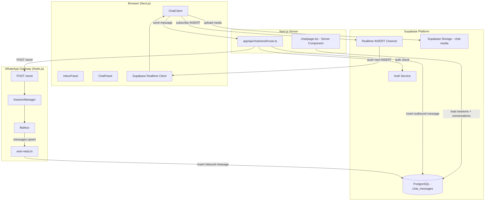
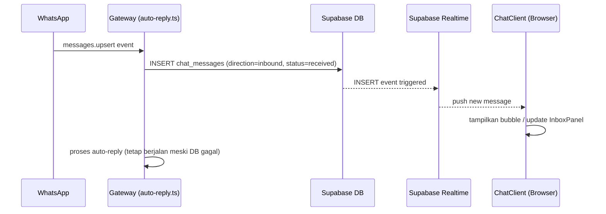
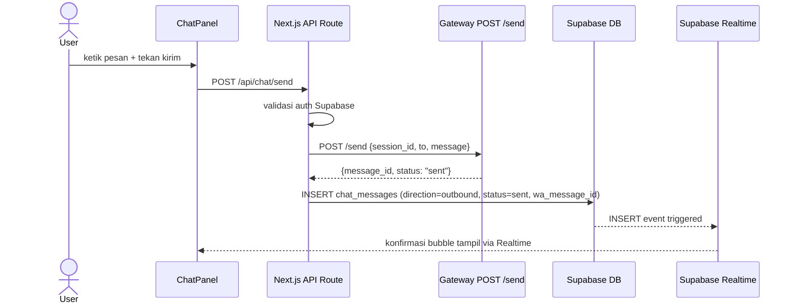
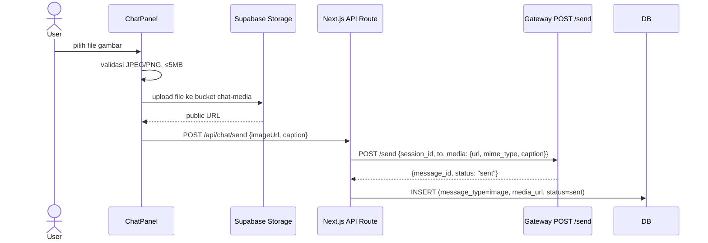

# Dokumen Desain: WhatsApp Chat Inbox

## Gambaran Umum

Fitur WhatsApp Chat Inbox menambahkan halaman percakapan dua arah ke dalam CRM yang sudah ada. Pengguna dapat melihat semua pesan masuk dan keluar per kontak, mengirim pesan teks dan gambar secara langsung, serta menerima pesan baru secara real-time tanpa reload halaman.

Sistem menggunakan tiga komponen yang sudah ada: **Gateway** (Node.js + Baileys + Fastify) untuk koneksi WhatsApp, **Backend** (Next.js API Routes) sebagai lapisan API yang aman, dan **Frontend** (Next.js App Router) sebagai antarmuka pengguna. Penyimpanan pesan di Supabase PostgreSQL, distribusi real-time via Supabase Realtime, dan media via Supabase Storage.

---

## Arsitektur



### Alur Pesan Masuk (Inbound)



### Alur Pesan Keluar (Outbound)



### Alur Kirim Gambar



---

## Komponen dan Antarmuka

### Struktur File Baru

```
apps/web/
└── app/
    ├── (app)/
    │   └── chat/
    │       ├── page.tsx                    # Server Component — load initial data
    │       └── _components/
    │           ├── ChatClient.tsx          # Client Component utama + Realtime
    │           ├── InboxPanel.tsx          # Panel kiri — daftar percakapan
    │           └── ChatPanel.tsx           # Panel kanan — bubble + input
    └── api/
        └── chat/
            └── send/
                └── route.ts               # POST handler kirim pesan

apps/gateway/src/
└── whatsapp/
    └── auto-reply.ts                      # MODIFIKASI: tambah simpan pesan inbound

supabase/migrations/
└── 20240101000009_chat_messages.sql       # Tabel chat_messages + RLS
```

### Interface Props Komponen Frontend

```typescript
// ChatClient.tsx
interface ChatClientProps {
  initialSessions: WaSessionRow[];
  initialConversations: ConversationSummary[];
}

// InboxPanel.tsx
interface InboxPanelProps {
  conversations: ConversationSummary[];
  activeContact: string | null;
  selectedSessionId: string | null;
  onSelectContact: (contact: ConversationSummary) => void;
}

// ChatPanel.tsx
interface ChatPanelProps {
  contact: ConversationSummary | null;
  sessionId: string | null;
  sessions: WaSessionRow[];
  onSessionChange: (sessionId: string) => void;
}

// Tipe data percakapan
interface ConversationSummary {
  contact_wa_number: string;
  contact_name: string | null;   // dari tabel contacts, null jika tidak ditemukan
  last_message_body: string | null;
  last_message_type: 'text' | 'image';
  last_message_at: string;
  wa_session_id: string;
}

// Tipe data pesan individual
interface ChatMessage {
  id: string;
  wa_session_id: string;
  contact_wa_number: string;
  direction: 'inbound' | 'outbound';
  message_type: 'text' | 'image';
  body: string | null;
  media_url: string | null;
  wa_message_id: string | null;
  status: 'received' | 'sent' | 'delivered' | 'read' | 'failed';
  created_at: string;
}
```

### API Route: POST /api/chat/send

```typescript
// Request body
interface SendMessageRequest {
  session_id: string;           // UUID dari wa_sessions
  to: string;                   // nomor tujuan format 628xxxxxxxxxx
  message?: string;             // teks (required jika bukan image)
  image_url?: string;           // URL dari Supabase Storage (untuk image)
  caption?: string;             // caption gambar (opsional)
}

// Response sukses (200)
interface SendMessageResponse {
  message_id: string;
  status: 'sent';
  chat_message_id: string;      // UUID row yang baru diinsert di chat_messages
}

// Response error (400/401/502)
interface SendMessageError {
  error: string;
  error_code?: string;
}
```

### Gateway: Modifikasi auto-reply.ts

Fungsi `handleIncomingMessage` dimodifikasi untuk menerima tambahan parameter `sessionDbId` (UUID wa_sessions) dan menyimpan pesan ke `chat_messages` **sebelum** proses auto-reply. Penyimpanan menggunakan `ON CONFLICT DO NOTHING` pada constraint unique `(wa_session_id, wa_message_id)` untuk idempotency.

```typescript
// Tambahan fungsi di auto-reply.ts
async function saveChatMessage(
  cfg: SupabaseConfig,
  sessionDbId: string,
  waNumber: string,
  messageId: string,
  messageText: string | null,
  messageType: 'text' | 'image',
  mediaUrl: string | null
): Promise<void>
```

---

## Model Data

### Tabel Baru: `chat_messages`

```sql
CREATE TABLE chat_messages (
    id                  UUID PRIMARY KEY DEFAULT gen_random_uuid(),
    wa_session_id       UUID NOT NULL REFERENCES wa_sessions(id) ON DELETE CASCADE,
    contact_wa_number   TEXT NOT NULL,
    direction           TEXT NOT NULL CHECK (direction IN ('inbound', 'outbound')),
    message_type        TEXT NOT NULL CHECK (message_type IN ('text', 'image')),
    body                TEXT,
    media_url           TEXT,
    wa_message_id       TEXT,
    status              TEXT NOT NULL CHECK (status IN ('received', 'sent', 'delivered', 'read', 'failed')),
    created_at          TIMESTAMPTZ NOT NULL DEFAULT now(),

    -- Unique constraint untuk mencegah duplikat dari Baileys
    CONSTRAINT chat_messages_unique_wa_msg UNIQUE (wa_session_id, wa_message_id)
);

-- Indeks utama untuk query riwayat percakapan
CREATE INDEX idx_chat_messages_conversation
    ON chat_messages(wa_session_id, contact_wa_number, created_at DESC);

-- Indeks untuk query daftar percakapan unik per nomor
CREATE INDEX idx_chat_messages_contact
    ON chat_messages(contact_wa_number);

-- Indeks untuk lookup by wa_message_id (status update dari Baileys ACK)
CREATE INDEX idx_chat_messages_wa_message_id
    ON chat_messages(wa_message_id, wa_session_id);
```

### Query Utama

**Daftar percakapan (InboxPanel):**
```sql
-- Ambil pesan terakhir per kontak, join ke contacts untuk nama
SELECT DISTINCT ON (contact_wa_number)
    cm.contact_wa_number,
    cm.body        AS last_message_body,
    cm.message_type AS last_message_type,
    cm.created_at  AS last_message_at,
    cm.wa_session_id,
    c.full_name    AS contact_name
FROM chat_messages cm
LEFT JOIN contacts c ON c.wa_number = cm.contact_wa_number
WHERE cm.wa_session_id = $1   -- opsional, jika ada filter sesi
ORDER BY contact_wa_number, cm.created_at DESC;
-- Kemudian sort hasil by last_message_at DESC di aplikasi
```

**Riwayat pesan per kontak (ChatPanel):**
```sql
SELECT * FROM chat_messages
WHERE wa_session_id = $1
  AND contact_wa_number = $2
ORDER BY created_at DESC
LIMIT 50
OFFSET $3;
```

### Supabase Storage

Bucket baru: **`chat-media`**
- Policy: authenticated users dapat upload
- Folder struktur: `{session_id}/{contact_wa_number}/{timestamp}_{filename}`
- File yang diizinkan: `image/jpeg`, `image/png`
- Ukuran maksimum: 5 MB (enforced di frontend sebelum upload)

### Perubahan Database Types

Tabel `chat_messages` perlu ditambahkan ke `apps/web/src/lib/supabase/database.types.ts`:

```typescript
chat_messages: {
  Row: {
    id: string;
    wa_session_id: string;
    contact_wa_number: string;
    direction: 'inbound' | 'outbound';
    message_type: 'text' | 'image';
    body: string | null;
    media_url: string | null;
    wa_message_id: string | null;
    status: 'received' | 'sent' | 'delivered' | 'read' | 'failed';
    created_at: string;
  };
  Insert: { /* semua field optional kecuali required */ };
  Update: { status?: '...'; };
}
```

### RLS Policy: `chat_messages`

```sql
-- Enable RLS
ALTER TABLE chat_messages ENABLE ROW LEVEL SECURITY;

-- Authenticated users dapat membaca semua chat_messages
-- (akses dikontrol lebih lanjut via wa_session_id yang hanya dimiliki org mereka)
CREATE POLICY "authenticated_read_chat_messages"
    ON chat_messages FOR SELECT
    TO authenticated
    USING (
        EXISTS (
            SELECT 1 FROM wa_sessions ws
            WHERE ws.id = chat_messages.wa_session_id
        )
    );

-- Hanya service role yang bisa insert/update (via Gateway dan API Route)
-- Frontend tidak perlu insert langsung
CREATE POLICY "service_role_write_chat_messages"
    ON chat_messages FOR ALL
    TO service_role
    USING (true)
    WITH CHECK (true);
```

---

## Correctness Properties

*A property is a characteristic or behavior that should hold true across all valid executions of a system — essentially, a formal statement about what the system should do. Properties serve as the bridge between human-readable specifications and machine-verifiable correctness guarantees.*

---

### Property 1: Round-trip penyimpanan pesan

*Untuk semua* pesan dengan atribut valid (wa_session_id, contact_wa_number, direction, message_type, body, status), menyimpan pesan ke `chat_messages` lalu mengambil kembali dengan ID yang sama harus menghasilkan objek yang identik dengan data yang disimpan.

**Validates: Requirements 1.1**

---

### Property 2: Idempotency insert pesan duplikat

*Untuk semua* pesan dengan `(wa_session_id, wa_message_id)` yang sama, menyimpan pesan tersebut dua kali harus menghasilkan tepat satu record di database tanpa menghasilkan error.

**Validates: Requirements 1.4**

---

### Property 3: Format nomor kontak selalu internasional

*Untuk semua* pesan yang berhasil disimpan di `chat_messages`, nilai `contact_wa_number` harus selalu dimulai dengan `"62"` dan hanya mengandung karakter digit.

**Validates: Requirements 1.5**

---

### Property 4: Pesan inbound selalu disimpan sebelum auto-reply

*Untuk semua* event `messages.upsert` yang diterima Gateway, operasi INSERT ke `chat_messages` harus selalu dipanggil sebelum handler auto-reply dieksekusi — bahkan ketika auto-reply tidak menghasilkan balasan.

**Validates: Requirements 2.1**

---

### Property 5: Kegagalan DB tidak menghentikan auto-reply

*Untuk semua* event `messages.upsert` di mana INSERT ke `chat_messages` gagal, handler auto-reply tetap harus dieksekusi dan error harus dicatat ke log.

**Validates: Requirements 2.3**

---

### Property 6: Atribut pesan inbound selalu konsisten

*Untuk semua* pesan inbound yang disimpan dari event `messages.upsert`, nilai `direction` harus `'inbound'`, nilai `status` harus `'received'`, nilai `message_type` harus `'text'` untuk pesan teks (dengan `body` terisi), dan `'image'` untuk pesan gambar (dengan `media_url` terisi dan tidak null).

**Validates: Requirements 2.4, 2.6**

---

### Property 7: InboxPanel menampilkan entri unik per kontak terurut terbaru

*Untuk semua* kumpulan pesan di database, daftar percakapan yang dihasilkan harus mengandung tepat satu entri per `contact_wa_number` unik, dan diurutkan secara descending berdasarkan waktu pesan terakhir.

**Validates: Requirements 4.1**

---

### Property 8: Preview pesan di InboxPanel tidak melebihi 40 karakter

*Untuk semua* entri percakapan yang di-render di InboxPanel, teks pratinjau pesan terakhir tidak boleh melebihi 40 karakter. Untuk pesan bertipe `'image'`, pratinjau harus menampilkan teks `"Gambar"`.

**Validates: Requirements 4.2, 4.3**

---

### Property 9: Pencarian InboxPanel hanya mengembalikan hasil relevan

*Untuk semua* query pencarian `q` dan semua daftar percakapan, setiap entri yang dikembalikan oleh filter pencarian harus mengandung `q` (case-insensitive) di dalam nama kontak atau nomor WhatsApp kontak.

**Validates: Requirements 4.6**

---

### Property 10: Pesan dalam ChatPanel selalu urut kronologis ascending

*Untuk semua* daftar pesan yang ditampilkan di ChatPanel untuk satu percakapan, nilai `created_at` dari setiap pesan harus lebih besar atau sama dengan nilai `created_at` pesan sebelumnya (urutan ascending, lama di atas, baru di bawah).

**Validates: Requirements 5.1**

---

### Property 11: Pagination ChatPanel tidak melebihi batas per halaman

*Untuk semua* permintaan load pesan di ChatPanel, jumlah pesan yang dikembalikan per request tidak boleh melebihi 50.

**Validates: Requirements 5.5**

---

### Property 12: Payload ke Gateway selalu lengkap

*Untuk semua* permintaan kirim pesan melalui API Route, payload yang diteruskan ke Gateway harus selalu mengandung field `session_id`, `to`, dan setidaknya salah satu dari `message` (untuk teks) atau `media.url` beserta `media.mime_type` (untuk gambar).

**Validates: Requirements 6.3, 7.6**

---

### Property 13: Pesan outbound berhasil selalu tersimpan dengan status konsisten

*Untuk semua* pesan yang berhasil dikirim melalui Gateway, record yang disimpan di `chat_messages` harus memiliki `direction = 'outbound'`, `status = 'sent'`, dan `wa_message_id` yang dikembalikan oleh Gateway. Untuk pesan gambar, `message_type = 'image'` dan `media_url` harus terisi.

**Validates: Requirements 6.4, 7.7**

---

### Property 14: Pesan outbound gagal selalu tersimpan dengan status failed

*Untuk semua* pesan yang gagal dikirim karena Gateway mengembalikan error, record yang disimpan di `chat_messages` harus memiliki `status = 'failed'`.

**Validates: Requirements 6.5**

---

### Property 15: Input kirim nonaktif ketika tidak ada sesi aktif

*Untuk semua* state halaman chat di mana tidak ada `wa_sessions` dengan `status = 'connected'`, tombol kirim dan input teks harus dalam keadaan disabled, dan dropdown sesi harus menampilkan pesan peringatan.

**Validates: Requirements 6.7, 9.4**

---

### Property 16: Validasi file gambar menolak format dan ukuran tidak valid

*Untuk semua* file yang dipilih, file dengan MIME type bukan `image/jpeg` atau `image/png` harus ditolak. File dengan ukuran melebihi 5 MB harus ditolak. Hanya file yang memenuhi kedua kriteria yang boleh diproses lebih lanjut.

**Validates: Requirements 7.2**

---

### Property 17: Upload gambar selalu mendahului pengiriman ke Gateway

*Untuk semua* pesan gambar yang dikirim, operasi upload ke Supabase Storage harus selalu selesai dan menghasilkan public URL sebelum request ke Gateway dikirimkan.

**Validates: Requirements 7.5**

---

### Property 18: Realtime update tampil di percakapan yang aktif

*Untuk semua* event INSERT `chat_messages` yang diterima via Supabase Realtime, jika `contact_wa_number` dan `wa_session_id` dari pesan baru cocok dengan percakapan yang sedang aktif di ChatPanel, bubble pesan baru harus langsung ditampilkan tanpa reload halaman.

**Validates: Requirements 8.2**

---

### Property 19: InboxPanel diperbarui untuk pesan kontak yang tidak aktif

*Untuk semua* event INSERT `chat_messages` yang diterima via Supabase Realtime di mana kontaknya bukan yang sedang aktif di ChatPanel, entri kontak tersebut di InboxPanel harus berpindah ke posisi teratas dengan preview pesan yang diperbarui.

**Validates: Requirements 8.3**

---

### Property 20: Dropdown sesi hanya menampilkan sesi connected

*Untuk semua* sesi yang ditampilkan di dropdown pemilihan WA_Session di ChatPanel, setiap sesi harus memiliki `status = 'connected'` di tabel `wa_sessions`.

**Validates: Requirements 9.1**

---

### Property 21: Filter sesi menghasilkan percakapan yang konsisten

*Untuk semua* percakapan yang ditampilkan di InboxPanel setelah filter sesi diterapkan, nilai `wa_session_id` dari setiap percakapan harus sama dengan sesi yang dipilih.

**Validates: Requirements 9.3**

---

### Property 22: API Route menolak request tanpa autentikasi

*Untuk semua* request ke `POST /api/chat/send` yang tidak menyertakan token Supabase Auth yang valid, API Route harus mengembalikan HTTP status 401 dan tidak meneruskan request ke Gateway.

**Validates: Requirements 10.3, 10.4**

---

## Penanganan Error

| Skenario | Penanganan |
|---|---|
| INSERT `chat_messages` gagal di Gateway | Log error, lanjutkan auto-reply |
| Gateway timeout saat kirim pesan | API Route return 502, simpan status `'failed'` |
| Upload media ke Storage gagal | Batalkan pengiriman, tampilkan error di UI |
| File gambar tidak valid (format/ukuran) | Tolak di frontend, tampilkan pesan spesifik |
| Supabase Realtime terputus | Reconnect otomatis (handled by Supabase client), tampilkan indikator |
| Tidak ada WA_Session connected | Nonaktifkan input, tampilkan peringatan |
| Pesan masuk dari group WA (suffix @g.us) | Skip — tidak disimpan ke `chat_messages` |
| `wa_message_id` duplikat | `ON CONFLICT DO NOTHING` — abaikan silently |

---

## Strategi Testing

### Unit Testing

Unit test difokuskan pada logika murni yang tidak bergantung pada DOM atau jaringan:

- `saveChatMessage()` di auto-reply.ts: verifikasi payload yang dikirim ke Supabase REST API
- Validasi file gambar: fungsi `validateImageFile(file)` dengan berbagai MIME type dan ukuran
- Format timestamp pesan: fungsi `formatMessageTime(date)` menghasilkan format yang benar untuk hari ini vs hari lain
- Truncate preview pesan di InboxPanel: teks >40 karakter dipotong dengan benar
- Normalisasi nomor WA: format `+62xxx`, `08xxx`, `62xxx` dikonversi ke `62xxx`

### Property-Based Testing

Library: **fast-check** (sudah tersedia di root `node_modules/`)

Setiap property test dikonfigurasi minimum **100 iterasi**. Setiap test diberi tag komentar dengan format:

```
// Feature: whatsapp-chat-inbox, Property N: <teks property>
```

| Property | Generator | Apa yang Diverifikasi |
|---|---|---|
| P1 Round-trip | pesan acak dengan field valid | data identik setelah simpan-ambil |
| P2 Idempotency | pesan dengan wa_message_id duplikat | hanya 1 record, tanpa error |
| P3 Format nomor | berbagai format string nomor | selalu dimulai `62`, hanya digit |
| P6 Atribut inbound | event messages.upsert acak | direction, status, message_type konsisten |
| P7 Unique per kontak | array pesan dari berbagai kontak | satu entri per nomor, urut desc |
| P8 Preview ≤40 char | body pesan dengan panjang bervariasi | truncate benar, gambar tampil "Gambar" |
| P9 Search filter | query dan daftar kontak acak | semua hasil mengandung query |
| P10 Urutan kronologis | array pesan acak | sorted ascending by created_at |
| P12 Payload Gateway | input kirim teks/gambar | field session_id, to, message/media selalu ada |
| P16 Validasi file | file dengan berbagai MIME dan ukuran | tolak yang tidak valid, terima yang valid |
| P22 Auth check | request dengan/tanpa token | 401 tanpa token, lanjut dengan token valid |

### Testing Strategy Keseluruhan

- **Unit tests**: fungsi utilitas murni (validasi, formatting, normalisasi)
- **Property tests**: logika bisnis yang berlaku untuk semua input (fast-check, min 100 iterasi)
- **Integration tests** (opsional): roundtrip melalui API Route ke mock Gateway
- **E2E tests** (opsional): alur kirim pesan dan terima pesan via Playwright
